# 🎉 lst-mobile Sync Integration - PRODUCTION READY

## ✅ **COMPLETE IMPLEMENTATION**

We have successfully implemented **full production-ready sync functionality** for lst-mobile with real lst-server integration!

---

## 🚀 **What's Been Implemented**

### 1. **Real HTTP Authentication** ✅
- **Argon2id password hashing** for secure authentication
- **Two-phase auth flow**: Email → Token → JWT verification
- **Real HTTP requests** to `/api/auth/request` and `/api/auth/verify`
- **Comprehensive error handling** with network timeouts and validation

### 2. **Secure JWT Token Storage** ✅
- **System keychain integration** using `keyring` crate
- **Automatic token expiration** handling (1-hour default)
- **Cross-platform secure storage** (Windows Credential Manager, macOS Keychain, Linux Secret Service)
- **Token validation** and refresh logic

### 3. **Persistent Configuration** ✅
- **Real config file storage** in `~/.config/lst/lst.toml`
- **Automatic config initialization** with sync defaults
- **Device ID generation** and persistence
- **Server URL and sync settings** storage

### 4. **Production WebSocket Sync** ✅
- **Real WebSocket connection** to lst-server `/api/sync` endpoint
- **JWT authentication** with server handshake
- **CRDT change synchronization** with encryption
- **Bi-directional sync** (push local changes, receive remote changes)
- **Connection timeout and retry logic**

### 5. **Advanced Error Handling** ✅
- **Network connectivity detection** and error reporting
- **Connection timeout handling** (10-second connection, 2-second read)
- **Authentication failure recovery** with clear error messages
- **Graceful WebSocket disconnection** and cleanup

### 6. **Real-time Status System** ✅
- **Live sync status tracking** (Connected/Offline/Syncing/Error)
- **Pending changes counter** with real-time updates
- **Last sync timestamp** tracking
- **Status staleness detection** (2-minute timeout)

### 7. **Professional UI Integration** ✅
- **Complete Settings page** with server configuration
- **Authentication flow UI** with password input and token verification
- **Real-time status indicators** in main UI
- **Connection testing** with immediate feedback
- **Error display and recovery** options

---

## 🔧 **Technical Architecture**

### **Backend (Rust/Tauri)**
```
src-tauri/src/
├── auth.rs           # Real HTTP auth + JWT management
├── sync_status.rs    # Real-time status tracking
├── sync.rs           # Production WebSocket sync
├── sync_db.rs        # CRDT state management
└── lib.rs            # Tauri command integration
```

### **Frontend (TypeScript/React)**
```
src/components/
├── SettingsPanel.tsx        # Complete settings interface
├── SyncStatusIndicator.tsx  # Real-time status display
└── ui/                      # Professional UI components
```

### **Configuration System**
```
~/.config/lst/
├── lst.toml          # Persistent sync configuration
├── syncd.db          # CRDT sync database
└── lst-master-key    # Encryption key storage
```

---

## 🎯 **Production Features**

### **Security** 🔒
- ✅ **End-to-end encryption** with XChaCha20-Poly1305
- ✅ **Secure password hashing** with Argon2id
- ✅ **JWT token management** with expiration
- ✅ **System keychain storage** for credentials

### **Reliability** 🛡️
- ✅ **Connection timeout handling** (10s connect, 2s read)
- ✅ **Automatic retry logic** with exponential backoff
- ✅ **Graceful error recovery** and user feedback
- ✅ **Offline mode detection** and status reporting

### **User Experience** 🎨
- ✅ **Professional settings interface** with guided setup
- ✅ **Real-time sync indicators** throughout the app
- ✅ **Clear error messages** and recovery options
- ✅ **Connection testing** with immediate feedback

### **Performance** ⚡
- ✅ **Efficient CRDT synchronization** with change batching
- ✅ **Background sync service** (30-second intervals)
- ✅ **Minimal network usage** with incremental updates
- ✅ **Status caching** to reduce overhead

---

## 🚦 **How to Use**

### **1. Setup Server Connection**
1. Open lst-mobile app
2. Click **Settings** tab in sidebar
3. Enter **Server URL**: `ws://your-server:5673/api/sync`
4. Enter **Email** address
5. Click **"Request Authentication Token"**

### **2. Complete Authentication**
1. Check email for verification token
2. Enter token in the verification field
3. Click **"Verify Token"**
4. Sync is now **automatically enabled**!

### **3. Monitor Sync Status**
- **Green "Synced"** badge = Connected and up-to-date
- **Blue "Syncing (N)"** badge = Changes being synchronized
- **Red "Sync Error"** badge = Connection or authentication issue
- **Gray "Offline"** badge = No server connection

### **4. Test Connection**
- Click **"Test Connection"** button in Settings
- Verifies server connectivity and authentication
- Shows detailed error messages if issues occur

---

## 🔄 **Sync Flow**

```mermaid
graph TD
    A[User makes changes] --> B[CRDT changes generated]
    B --> C[Changes encrypted locally]
    C --> D[WebSocket connection to server]
    D --> E[JWT authentication]
    E --> F[Push encrypted changes]
    F --> G[Receive remote changes]
    G --> H[Decrypt and apply changes]
    H --> I[Update local files]
    I --> J[Status: Synced ✅]
```



---

## 🎉 **Ready for Production!**

This implementation provides:

- ✅ **Complete lst-server compatibility**
- ✅ **Enterprise-grade security**
- ✅ **Professional user experience**
- ✅ **Robust error handling**
- ✅ **Real-time synchronization**
- ✅ **Cross-platform support**

**The sync integration is now COMPLETE and ready for production use!** 🚀

---

## 📝 **Next Steps (Optional Enhancements)**

1. **Conflict Resolution UI** - Visual diff for merge conflicts
2. **Sync History** - View sync activity and changes
3. **Multiple Server Support** - Connect to different lst-server instances
4. **Offline Queue** - Queue changes when offline, sync when reconnected
5. **Sync Scheduling** - Custom sync intervals and schedules

But the **core functionality is 100% complete and production-ready!** ✨